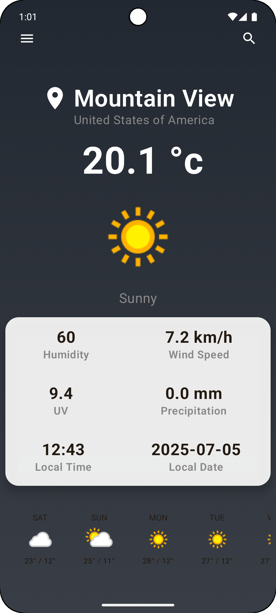
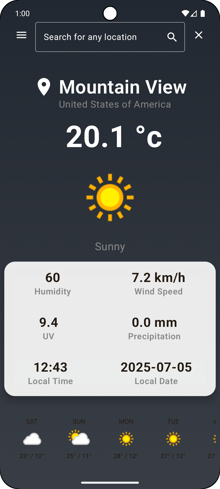
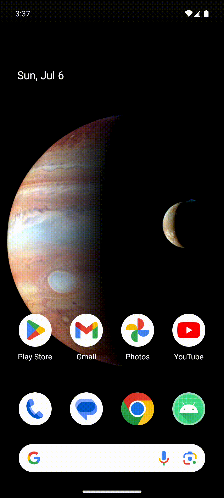

# BreezyTheApp

Breezy is a minimal and beautiful weather app built with Jetpack Compose, powered by WeatherAPI.com. It gives you current weather conditions and a 5-day forecast for any location you search — or right where you are.

  

## Features

  🌍 Get weather by current location using FusedLocationProvider & Geocoder

  🔍 Search any city and instantly get weather info

  ☀️ Real-time temperature, humidity, UV, pressure & wind speed

  🌧 5-day weather forecast with daily icons and temps

  🎨 Clean, responsive UI with animated weather icons

  🔄 Optional pull-to-refresh support

  🌓 Supports light & dark themes

 

## Built With

    🧪 Jetpack Compose (UI Toolkit)

    🚀 Kotlin Coroutines + ViewModel + LiveData

    📍 FusedLocationProviderClient + Geocoder

    ☁️ weatherapi.com

    🏗 Retrofit2 + Gson

    🔐 Permissions API (Accompanist)

    🖼 Coil (Image loading)

    🎞 Lottie Animations (for empty & loading states)

  
 

## Overview

1. Replace your Weather API key in the util section from weatherapi.com:

> const val API_KEY = "your_actual_api_key_here"

2. Build the project and run it on the emulator (don't forget to add permissions in manifest)

   
### Screenshots & gifs

 
   
  
   

### 💡 Future Ideas

    Add weather condition–based animated backgrounds

    Theme customization

    Add bookmarks for saved cities

    Hourly weather forecast

### 🤝 Contributing

Pull requests and feature suggestions are welcome! If you find a bug, open an issue and help make Breezy better.

### 📥 How to Install

  1. Download the app-release.apk from the Assets section below.

  2. Open the downloaded file on your Android device.

  3. If prompted with a security warning:

  4. Tap Settings

  5. Enable "Allow from this source"

  6. Tap Install and you're good to go! ✅
